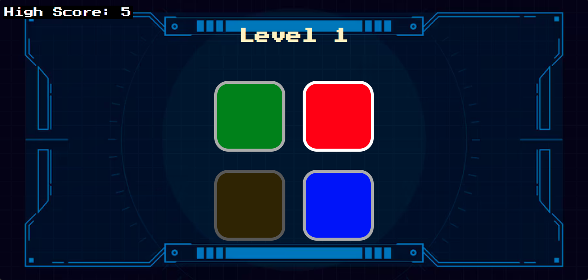

```
Simon Game 🎮  

A fun and interactive Simon Game built using HTML, CSS, and JavaScript. Test your memory and see how many levels you can complete!  

🚀 Live Demo  
🔗 Play the game here: [Simon Game]( https://mdparvezmussaruf.github.io/simons-game/ )  

📌 How to Play  
1. Press any key to start the game.  
2. Watch the sequence of colors light up.  
3. Repeat the pattern by clicking the buttons in the correct order.  
4. If you get it right, the sequence gets longer.  
5. If you make a mistake, the game is over!  

🛠️ Technologies Used  
- HTML5  
- CSS3  
- JavaScript (jQuery)  

📷 Screenshot  
  

📥 Installation  
If you want to run the game locally:  
1. Clone the repository:  
   ```sh
   git clone https://github.com/mdparvezmussaruf/simons-game.git
   ```
2. Open `index.html` in your browser.  

📌 Features  
✅ Interactive button animations  
✅ Sound effects for each button  
✅ High score tracking using `localStorage`  
✅ Fully responsive design  

💡 Improvements  
- Adding difficulty levels  
- Mobile-friendly UI improvements  
- Additional sound & visual effects  

🤝 Contributing  
Feel free to fork this repository and submit a pull request with your improvements!  

📜 License  
This project is open-source and available under the **MIT License**.  

---

💙 Built by [Parvez Mussaruf](https://github.com/mdparvezmussaruf)  
```
